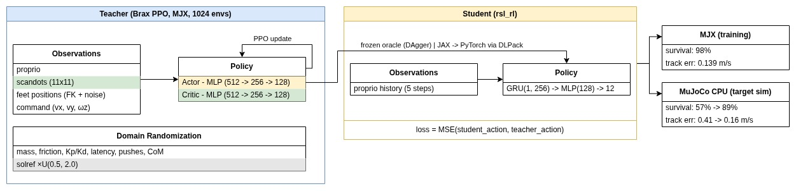
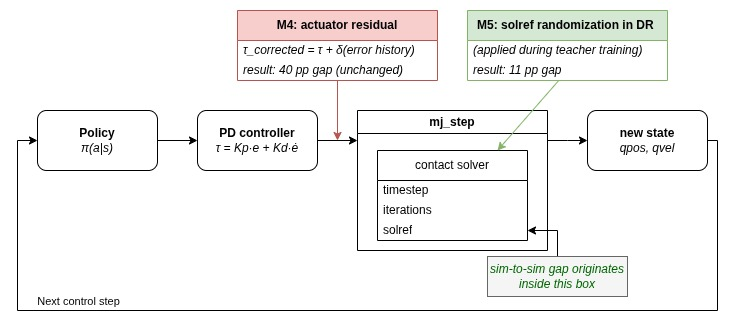
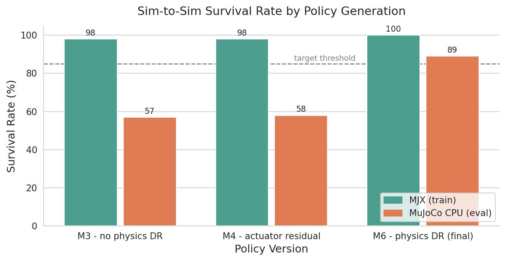

# Quadruped Locomotion RL - Spot

#### Goal:
Build a teacher-student locomotion stack for Boston Dynamics Spot, deploy the proprioception-only student across simulators, quantify and try to close the sim-to-sim gap.

Get hands-on experience with the following concepts:
 - massively parallel GPU RL (MJX)
 - teacher-student distillation
 - sim-to-sim evaluation

#### Summary:
This project trained a Brax PPO teacher policy in MJX on a rough terrain locomotion task using scandots. The teacher was then distilled into a proprio-only student via DAgger. Evaluation on MuJoCo CPU revealed a 41-percentage-point survival drop, which Hwangbo-style actuator-residual network (2019) [arXiv:1901.08652] (the originally planned fix) failed to close, because the gap originates inside the contact solver rather than in actuator dynamics.

The working fix was physics-level domain randomization on contact stiffness during teacher retraining. The new student survives 89% of CPU rollouts versus 100% on MJX, inside the 15 pp / 0.2 m/s budget set at the start.

#### Stack:
 - MuJoCo Playground (MJX) for training
 - MuJoCo CPU for sim-to-sim evaluation
 - Brax PPO for the teacher
 - rsl_rl + PyTorch for the student via the DLPack JAX↔Torch bridge from wrapper_torch.py
 - PyTorch for the actuator residual network
 - Weights & Biases for experiment tracking

Hardware: RTX 500 Ada GPU (4 GB VRAM) - all training and evaluation locally

#### Final video:
Student policy running in both simulators. MJX on the left, MuJoCo CPU on the right.


#### Teacher-Student Pipeline:
The teacher trains with privileged terrain info (scandots), then a proprio-only student is distilled from it via DAgger - no scandots, no FK-derived feet positions, just proprioception.

<div align="center">
  
</div>


#### Control Step:
One tick of the policy: proprioceptive history flows through the encoder and actor, producing joint position targets that drive Spot's PD loop at the underlying physics rate.

<div align="center">
  
</div>


#### Results:
Survival rate across three student variants: the baseline student from M3 (no physics DR), student with actuator residual (M4), and the redistilled student from M6 (after solref randomization was added to teacher training).

<div align="center">
  
</div>

---

# Step by step report
The following briefly describes the entire process, step by step. It is basically a project log.

## M0 - Environment setup

Working repo with MuJoCo Playground installed as a submodule, wandb wired, first smoke test at 512 envs.

```
Confirmed: <2.5 GB VRAM peak at 512 envs with XLA_PYTHON_CLIENT_PREALLOCATE=false
```

---

## M1 - Flat-terrain locomotion

**Deliverable:** Spot joystick policy trained from scratch with Brax PPO on flat terrain. Video of stable walking gait.

### Detour: ANYmal C (abandoned)

The original plan was ANYmal C (ANYbotics, 50 kg, 12 DOF) - a vetted MJX MJCF already existed in Menagerie. The Go1-to-ANYmal C port was mechanically straightforward: MJCF loaded, physics ran, observations and rewards wired up cleanly. Training never produced walking. After ~40 runs across reward formulations and physics parameters, I switched to Spot. No public PPO baseline for ANYmal C in MJX exists - which might be a good indication that it is not trivial. Diagnosing the failure further was out of scope.

The video shows some of the rollouts. The policy converges to jumping, standing, and even some tries at walking, but never learns to actually walk.


### Spot flat-terrain

Spot ships natively in MuJoCo Playground, so M1 was running the existing environment and confirming a stable trot.


---

## M2 - Rough terrain + curriculum + DR, teacher policy

**Deliverable:** Teacher policy that walks on rough terrain. Scandots (11×11 height grid) added as privileged observation. Domain randomization on mass (0.8-1.2×), base CoM (±5 cm), friction (0.4-1.2), motor latency (0-40 ms), Kp/Kd (±20%), push perturbations.

**Curriculum:** 10 speed levels. The terrain is fixed throughout training - what gets harder is the commanded velocity. Levels 0-9 map to [0.4, 0.5, 0.6, 0.7, 0.8, 0.9, 1.0, 1.1, 1.3, 1.5] m/s. The robot advances to the next level once it tracks the current target within 0.25 m/s over 80% of an episode.

**Training:** 200M env steps, 1024 envs, MLP actor-critic [512, 256, 128].

**Training command:**
```bash
python -m learning.train_jax_ppo --env_name SpotJoystickRoughTerrain --num_envs 1024 --num_timesteps 200000000 --domain_randomization --use_wandb --num_evals 40
```

**Pass criteria:**
- Survival rate on held-out rough terrain > 85% over 10 s episodes at 1.0 m/s command
- Tracking error < 0.25 m/s on rough terrain
- Mean curriculum level (normalized 0-1) ≥ 0.60 at end of training

**Evaluation:**
```bash
python evaluate/m2/eval_metrics.py \
--checkpoint_dir  \
--num_seeds 100
```

**Results (1000 envs × 500 steps):**

| Criterion | Result | Threshold | Status |
|-----------|--------|-----------|--------|
| Survival (10 s, 1 m/s, rough) | 0.994 | ≥ 0.85 | PASS |
| Tracking (pre-fall, rough) | 0.1949 m/s | ≤ 0.25 m/s | PASS |
| Mean curriculum level (normalized) | 0.788 | ≥ 0.60 | PASS |

To record videos:
```bash
python evaluate/m2/record_videos.py \
--checkpoint_dir  \
--output_dir 
```

The following video shows the teacher policy learning on rough terrain.


The following video shows the final teacher policy walking on rough terrain.


<!-- #TODO - opened PR to mujoco playground to integrate rough terrain for spot  -->

---

## M3 - Student distillation, proprio-only

**Deliverable:** Blind student policy trained via DAgger on the M2 teacher. Observation: proprio history (last 5 timesteps of base ang_vel, projected gravity, joint pos/vel, last action, commands). No feet positions, no scandots, no privileged state.

Architecture: rsl_rl GRU-RNN student (1 layer, 256 hidden, MLP head [128]) trained via pure action MSE against a frozen JAX teacher oracle. The M2 Brax PPO checkpoint is used directly - no teacher re-training. JAX-to-PyTorch conversion via DLPack (same bridge as `wrapper_torch.py`). rsl_rl is used only for the student model and optimizer, not for PPO training.

**Note:** M3 can technically be skipped - the M2 actor does not see scandots, only the critic did. The actor sees feet positions (FK + noise), which is fully reproducible on real hardware from joint encoders, so M2 is already deployable. The point of M3 is to go through teacher-student distillation and remove the FK dependency. M3 student is clean proprioception-only.

**Training command:**
```bash
python train/train_student_distill.py --config configs/distill_spot_proprio.yaml --wandb
```

**Results (800 distillation iterations, 128 envs × 500 steps):**

| Criterion | Result | Threshold | Status |
|-----------|--------|-----------|--------|
| Imitation MSE (free cmd, student vs teacher) | 0.00588 | ≤ 0.05 | PASS |
| Survival rate (rough terrain, random cmd) | 0.820 | ≥ 0.75 | PASS |
| Gait frequency | 1.80 Hz | [1.5, 4.0] Hz | PASS |
| Tracking error at 1.0 m/s | 0.1855 m/s | ≤ 0.40 m/s | PASS |

```bash
python evaluate/m3/eval_metrics.py \
--student_checkpoint  \
--teacher_checkpoint_dir 
```

The following video shows teacher vs student side-by-side on rough terrain.


---

## M3.5 - Evaluate the student across different simulators

This is essentially M5, executed early as a sanity check - if the gap were already too large to close (or maybe no gap at all), there would be no point in continuing to M4. Genesis was in the original plan as a third target, but integrating Spot was well beyond scope. MuJoCo CPU turned out to be enough - it broke the policy.

Student policy (M3) evaluated zero-shot across simulators with no retraining.
100 episodes × 30 s, forward command 1.0 m/s, rough terrain.

| Simulator   | Survival | Track Err (m/s) | Height Dev (m) | Feet Force RMS (N) |
|-------------|----------|-----------------|----------------|--------------------|
| MJX (train) | 98%      | 0.181 ± 0.006   | 0.022 ± 0.001  | 60.4 ± 1.4         |
| MuJoCo CPU  | 57%      | 0.407 ± 0.390   | 0.029 ± 0.008  | 56.3 ± 10.9        |

**Survival drop: 41 pp. Tracking drift: 0.227 m/s. Both criteria FAIL.**

The degradation is not gradual. Tracking error is bimodal: episodes either succeed cleanly (~0.088 m/s) or fail catastrophically (~0.90 m/s). Almost no middle ground.

Fall timing analysis:

| Simulator  | Falls | [0-50] | [51-200] | [201+] | Mean fall step |
|------------|-------|--------|----------|--------|----------------|
| MJX        | 2     | 0      | 0        | 2      | 1075           |
| MuJoCo CPU | 43    | 6      | 37       | 0      | 75             |

### What might be the cause

MJX runs with a coarser timestep (2 ms) and a single solver iteration. MuJoCo CPU runs at 0.5 ms with 4 solver iterations, producing sharper, more accurate ground reaction forces at foot strike. The student policy, trained entirely in MJX, learned foot-strike timing and torque magnitudes calibrated to MJX's softened contact model. When those same actions meet MuJoCo CPU's contact resolution, the first stride produces unexpected reaction forces the policy has no history of recovering from.

This is the baseline gap that M4 attempts to close.

**Evaluation command** (script shared with M5 eval, developed once and reused here):
```bash
python evaluate/m5/sim2sim_eval.py --num_episodes 100
```

The following video shows the student policy in MJX vs MuJoCo CPU side-by-side on rough terrain.


---

## M4 - Actuator-network residual

The sim-to-sim gap observed in M3 motivates adding an actuator-network residual. Hwangbo et al. (2019) [arXiv:1901.08652] showed that a small MLP trained on real motor data can close the actuator modelling gap for legged robots. Since no physical hardware is available, the residual is instead trained on cross-simulator deltas - single-step CPU MuJoCo replay against MJX rollouts - as a proxy. This is not a reproduction of Hwangbo's method, it is a sim-to-sim analogue.

**Deliverable:**
Small MLP (3-layer [128, 128, 64] → 12 torque outputs) that takes joint position error, velocity error, commanded torque, and history of length 4 - and outputs a torque correction on top of the nominal PD actuator.

The residual is collected offline, trained in PyTorch, then re-implemented in JAX (Flax) and injected into the MJX env, so the M2 teacher can be fine-tuned (30M PPO steps) under residual-augmented dynamics.

**Pass criteria:**
Residual MSE < 0.1 Nm per joint. Sim-to-sim gap shrinks under 15% versus no-residual teacher.

**Commands:**

1. Collect data - roll out M2 teacher and capture per-substep torque gap between MJX and MuJoCo CPU.
```bash
python train/actuator_residual/collect_data.py \
    --teacher_ckpt  \
    --n_episodes 50 --ctrl_steps 1000 \
    --out train/actuator_residual/data/residual.npz
```

2. Train residual network on the collected torque-gap data.
```bash
python train/actuator_residual/residual_network.py \
    --data train/actuator_residual/data/residual.npz \
    --epochs 100 \
    --batch 2048 \
    --ckpt checkpoints/actuator_residual.pt
```

3. Fine-tune teacher (M2) with residual network for 30M steps.
```bash
python train/actuator_residual/finetune_teacher.py \
    --teacher_ckpt  \
    --residual_ckpt 
```

### Results - actuator residual's sim-to-sim impact

100 episodes × 30 s, forward command 1.0 m/s, rough terrain. Four configs: MJX with/without residual, CPU with/without residual.

| Config | Survival | Track Err (m/s) | Height Dev (m) | Feet Force RMS (N) |
|--------|----------|-----------------|----------------|--------------------|
| mjx_baseline | 98% | 0.184 ± 0.008 | 0.022 ± 0.001 | 61.3 ± 1.5 |
| mjx_residual | 97% | 0.183 ± 0.007 | 0.022 ± 0.001 | 60.6 ± 1.6 |
| cpu_baseline | 58% | 0.411 ± 0.408 | 0.033 ± 0.012 | 54.6 ± 9.8 |
| cpu_residual | 58% | 0.405 ± 0.408 | 0.033 ± 0.012 | 54.4 ± 9.7 |

Survival gap is 40 pp - the residual changed nothing on CPU.

```bash
python evaluate/m4/teacher_eval.py \
    --teacher_ckpt  \
    --num_videos  \
    --results_dir 
```

### Why the approach failed (most likely)

The residual worked as trained - R²=0.62 means it captured a real portion of the torque gap. The problem is where it intervenes.

Torque corrections are applied after `mj_step` returns. But the gap doesn't originate there - it originates inside `mj_step`, in the contact solver. MJX and MuJoCo CPU resolve foot contacts differently: different timestep, different iteration count, different constraint stiffness. Those differences produce different ground reaction forces at foot strike, before any torque correction can run.

By the time the residual acts, the foot has already landed wrong. The corrected torques then drive the robot into states it has never seen, making things worse. The gap was in the contact solver, not in the actuators - a downstream torque patch cannot fix an upstream contact resolution.

This was checked and validated in the next milestone (M5).

---

## M5 - Teacher robustness diagnostic

M4 identified the contact solver as the root cause. The fix is physics domain randomization - randomize solver parameters during training so the policy learns to handle the range between MJX and MuJoCo CPU.

There are two possible paths forward:

- **Case A:** teacher survives physics DR - distill student directly under physics-DR, no teacher retraining.
- **Case B:** teacher doesn't survive - retrain teacher under physics-DR first, then distill.

To decide what's next, two tests were done.

#### Test 1 - `mjx_cpu_faithful` (sanity check)

Set MJX solver parameters to exactly match MuJoCo CPU: `opt.timestep=0.0005`, `opt.iterations=4`, default solref/solimp, applied via `tree_replace`. If the teacher fails even here, the gap is more fundamental than DR can fix. If it walks, the teacher can already handle CPU-like contacts - the question is only whether it generalizes across physics variation.

| Config | Survival | Track Err (m/s) | Height Dev (m) | Feet Force RMS (N) |
|--------|----------|-----------------|----------------|--------------------|
| mjx_cpu_faithful | 100% | 0.158 ± 0.005 | 0.020 ± 0.001 | 49.1 ± 0.2 |

**Interpretation:** the teacher walks cleanly at this exact CPU configuration. This rules out a fundamental incompatibility between the policy and CPU-like contacts. The gap isn't that CPU physics are inherently alien to the policy - the policy was simply never exposed to variation across physics parameters. That should be fixable with DR.

**What this does not prove:** robustness across the full DR distribution. That distribution covers `timestep ∈ {1, 2, 4} ms`, `iters ∈ {1, 2, 4}`, `solref × U(0.5, 2.0)`, `solimp × U(0.5, 2.0)`. `mjx_cpu_faithful` lives at one corner of that box (its 0.5 ms timestep is actually outside it - excluded from DR for VRAM reasons).

#### Test 2 - Teacher under M5 DR distribution

Run M2 teacher on 100 envs sampled from the full M5 DR distribution. Survival decides Case A vs Case B.

```bash
python evaluate/m4/teacher_under_dr.py \
    --teacher_ckpt  \
    --randomize_fn mujoco_playground._src.locomotion.spot.randomize:domain_randomize \
    --num_episodes 100
```

| Config | Survival | Track Err (m/s) | Height Dev (m) | Feet Force RMS (N) |
|--------|----------|-----------------|----------------|--------------------|
| mjx_dr (n=100) | 62% | 0.377 ± 0.125 | 0.044 ± 0.018 | 287.7 ± 142.2 |

| Falls total | [0-50] | [51-200] | [201-500] | [500+] | Mean fall step |
|-------------|--------|----------|-----------|--------|----------------|
| 38 | 1 | 15 | 13 | 9 | 350 |

62% makes this Case B. FeetForce (287N vs ~60N normal) and 38 total falls suggest the teacher is struggling or implementation is wrong. Policy retraining with a new DR should answer this.

### Policy retraining with physics DR

Same as M2, with one addition to `domain_randomize`:

```python
rng, key = jax.random.split(rng)
geom_solref = model.geom_solref.at[FLOOR_GEOM_ID, 0].set(
    model.geom_solref[FLOOR_GEOM_ID, 0]
    * jax.random.uniform(key, minval=0.5, maxval=2.0)
)
```

```bash
python -m learning.train_jax_ppo \
--env_name SpotJoystickRoughTerrain \
--num_envs 1024 \
--num_timesteps 150000000 \
--domain_randomization \
--use_wandb \
--num_evals 40
```

The `--domain_randomization` flag triggers the modified `domain_randomize` with solref randomization included.

**Validate:**
```bash
python evaluate/m4/teacher_eval.py \
--teacher_ckpt  \
--configs mjx_baseline cpu_baseline \
--num_videos  \
--results_dir 
```

| Config | Survival | Track Err (m/s) | Height Dev (m) | Feet Force RMS (N) |
|--------|----------|-----------------|----------------|--------------------|
| mjx_baseline (n=100) | 100% | 0.142 ± 0.003 | 0.027 ± 0.001 | 64.5 ± 1.0 |
| cpu_baseline (n=100) | 91% | 0.136 ± 0.263 | 0.029 ± 0.004 | 54.9 ± 3.2 |

Solref randomization brought CPU survival from 58% (M4 baseline) to 91%. It is worth to do a new student distillation in M6.

**Why not more physics randomization?**
Some parameters were excluded because they either break JAX's compilation model or produce physically invalid simulations. This is potentially fixable, but the goal of this project is to learn, and fixing this sounds like a time blackhole.

- *`opt.iterations`* - The number of iterations the contact solver runs each physics step to resolve collisions and constraints. More iterations means more accurate contacts, fewer means faster but noisier physics. Randomizing this might help the policy generalize better to different physics engines. The problem: MJX's solver contains a Python-level `if iterations == 1` branch that is evaluated when JAX compiles the simulation, not at runtime. This means the value must be fixed and identical across all environments - it cannot vary per-env under `vmap`.

- *`opt.timestep`* - The duration of each physics integration step. Smaller timestep means more accurate simulation, larger means faster but less stable. Randomizing it would stress-test whether the policy depends on a specific integration granularity. The problem: `n_substeps = round(ctrl_dt / sim_dt)` is computed once at construction and frozen as a Python int. Randomizing `sim_dt` later without recomputing it means each env runs a different amount of simulated time per control step - the PD controller fires at the wrong frequency, causing overshoot and falls.

- *`geom_solimp`* - Controls contact softness/stiffness: how much a contact surface compresses under load and how quickly it pushes back. Randomizing it would vary whether the ground feels more like concrete or a soft mat. The problem: MuJoCo requires `0 ≤ d_min ≤ d_max < 1`. The default floor has `d_min = 0.9`, `d_max = 0.95` - both already close to 1, leaving little headroom. Applying a shared multiplier to both while keeping `d_max < 1` is technically valid, but the usable randomization range ends up so narrow that the variation is negligible and not worth the added complexity.
---

## M6 - Student distillation from retrained teacher

Same procedure as M3 - same student architecture, same DAgger training, same evaluation harness. The only change is the teacher oracle: M5's physics-DR teacher instead of M2's.

**Train:**
```bash
python train/train_student_distill.py \
--config configs/distill_spot_proprio.yaml \
--wandb
```

**Validate:**
```bash
python evaluate/m5/sim2sim_eval.py \
--num_episodes 100 \
--num_videos <num_of_videos_to_record> \
--student_checkpoint <path_to_pt_file_from_train_command>
```

**Results:**
| Sim | Survival | Track Err (m/s) | Height Dev (m) | Feet Force RMS (N) |
|-----|----------|-----------------|----------------|--------------------|
| mjx (n=100) | 100% | 0.139 ± 0.003 | 0.028 ± 0.001 | 64.469 ± 0.940 |
| mujoco_cpu (n=100) | 89% | 0.162 ± 0.281 | 0.031 ± 0.004 | 57.771 ± 6.805 |

| Sim | Falls | [0-50] | [51-200] | [201-500] | [500+] | Median Fall Step |
|-----|-------|--------|----------|-----------|--------|------------------|
| mjx | 0 | 0 | 0 | 0 | 0 | - |
| mujoco_cpu | 11 | 0 | 11 | 0 | 0 | 102.5 |

The sim-to-sim gap is considered closed when survival drop < 15 pp and tracking error gap < 0.2 m/s. Both satisfied: 11 pp survival drop (down from 41 pp in M3.1), 0.023 m/s tracking gap.

---

## M7 - Final Result

The original assumption was that a Hwangbo-style actuator residual would close the sim-to-sim gap. It turned out the gap was in the contact solver, not the actuators. A torque correction applied after `mj_step` returns cannot fix a contact resolution that has already happened.

The actual fix was one line of solref randomization added to the DR function during teacher retraining. The redistilled student went from 57% survival on MuJoCo CPU (M3.1, no physics DR) to 89% (M6), within the 15 pp / 0.2 m/s budget defined at the start of the project.

The main takeaway: picking the right axis of randomization mattered more than architectural complexity. A one-line change to the DR distribution did what a separately trained network could not.

## Repo layout
```
legged_rl_sim2sim/
├── mujoco_playground/          # submodule - google-deepmind/mujoco_playground fork
├── train/
│   ├── train_student_distill.py
│   └── actuator_residual/      # M4 - data collection, residual net, teacher fine-tune
├── evaluate/
│   ├── m2/                     # teacher evaluation and video recording
│   ├── m3/                     # student evaluation
│   ├── m4/                     # actuator residual evaluation
│   └── m5/                     # sim-to-sim eval (shared with M3.5 and M6)
├── configs/
│   └── distill_spot_proprio.yaml
└── README.md
```
